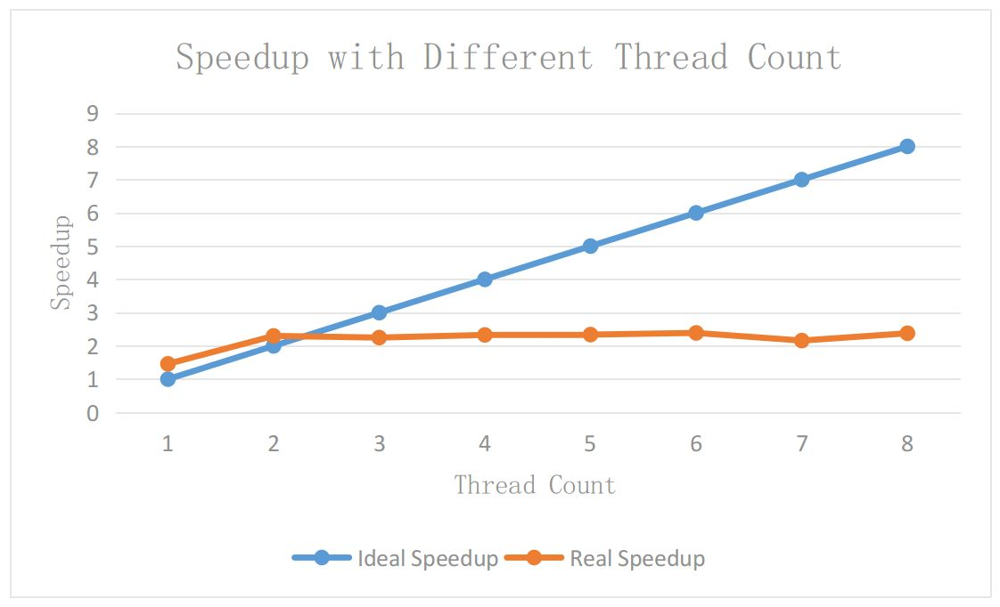

[](https://travis-ci.org/sunxfancy/HPar)

HPar
====


HPar is a paralleled HTML5 parser based on Jsoup. It has a 2.2x speedup in mulit-core systems compared with Jsoup.



This benchmark tested on Linux, Intel® Core™ i7-4710MQ CPU @ 2.50GHz × 8.

# Dependencies

jsoup 1.9.1
junit 3.8.1

# Build

HPar can be built by maven, in JDK 1.8 version.

```
git clone https://github.com/sunxfancy/HPar

mvn build
```

# Usage

HPar can be used as a normal Jsoup library. For parallaled HTML parsing, you need do the following steps:

```java
String data = "<html></html>";

// new Parser (or using new ParallelJsoup(data, threads_num) to set thread number)
ParallelJsoup pj = new ParallelJsoup(data);

// parse HTML
Document document = pj.parse();

```

The document is an object defined in Jsoup, you can use any kind of method to deal with it.

For more information about Jsoup, please read the API of jsoup: <https://jsoup.org/apidocs/>


# Rreferences

[HPar: A Practical Parallel Parser for HTML–Taming HTML Complexities for Parallel Parsing](http://www.cs.ucr.edu/~zhijia/papers/taco13.pdf#pdfjs.action=download)


# Licences

MIT
